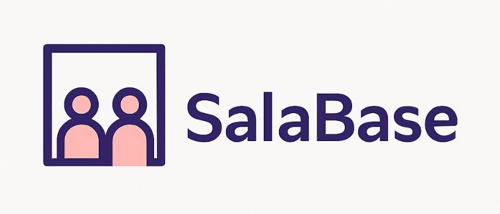

# Web Application Document - Projeto Individual - Módulo 2 - Inteli

## SalaBase - Uma Base Central de Salas

#### Amanda Cristina Martinez da Rosa

## Sumário

1. [Introdução](#c1)
2. [Visão Geral da Aplicação Web](#c2)
3. [Projeto Técnico da Aplicação Web](#c3)
4. [Desenvolvimento da Aplicação Web](#c4)
5. [Referências](#c5)

<br>

## <a name="c1"></a>1. Introdução

O SalaBase é uma plataforma web pensada para tornar mais fácil e organizada a rotina de quem precisa reservar salas no Inteli. A ideia surgiu da necessidade real de otimizar o uso dos espaços compartilhados dentro da faculdade, oferecendo aos alunos, professores e colaboradores uma forma prática e centralizada de verificar a disponibilidade de salas, agendar horários e evitar conflitos de uso.

Desenvolvido com Node.js, Express.js e banco de dados PostgreSQL, o sistema foi estruturado utilizando o padrão MVC (Model-View-Controller), o que garante uma base sólida para manutenção e futuras melhorias. Além de prezar por um backend funcional e bem organizado, o projeto também valoriza a experiência do usuário, priorizando uma navegação intuitiva e acessível.

O SalaBase não é apenas um exercício técnico — ele é uma resposta a um problema cotidiano, com potencial real de aplicação no ambiente universitário. Toda a lógica por trás do sistema foi pensada para ser clara, escalável e colaborativa, facilitando o desenvolvimento contínuo por diferentes integrantes da comunidade Inteli. Esta documentação apresenta o raciocínio por trás da modelagem do banco de dados, a estrutura geral do projeto e os caminhos criados para o sistema funcionar do início ao fim.


---

## <a name="c2"></a>2. Visão Geral da Aplicação Web

### 2.1. Personas 

_Posicione aqui sua(s) Persona(s) em forma de texto markdown com imagens, ou como imagem de template preenchido. Atualize esta seção ao longo do módulo se necessário._

### 2.2. User Stories 

_Posicione aqui a lista de User Stories levantadas para o projeto. Siga o template de User Stories e utilize a referência USXX para numeração (US01, US02, US03, ...). Indique todas as User Stories mapeadas, mesmo aquelas que não forem implementadas ao longo do projeto. Não se esqueça de explicar o INVEST de 1 User Storie prioritária._

---

## <a name="c3"></a>3. Projeto da Aplicação Web

### 3.1. Modelagem do banco de dados 


<p align="center">Figura 1 - Modelo de Entidade Relacional do banco de dados</p>

**Arquivo de modelagem física do banco de dados:** [initDB.sql](../scripts/initDB.sql)


A modelagem do banco de dados do SalaBase foi cuidadosamente planejada para permitir o gerenciamento eficiente de reservas de salas em um ambiente compartilhado por diferentes ateliês, usuários e grupos de trabalho. O sistema é composto por seis tabelas principais que se relacionam entre si de maneira lógica e estruturada:

- ```usuario``` (Usuário): Armazena as informações dos usuários cadastrados na plataforma, incluindo ```usuario_id``` (UUID), ```nome```, ```sobrenome```, ```email``` e o ```atelie``` ao qual pertencem. A associação com a tabela ```atelie``` indica o local de origem do usuário.

- ```atelie``` (Ateliê): Contém os ateliês existentes no sistema, com os campos ```atelie_id``` (UUID) e ```nome```. Essa tabela serve como referência para a organização dos usuários e dos grupos.

- ```salas``` (Salas): Representa as salas disponíveis para reserva, com informações como ```sala_id``` (UUID), ```nome```, ```categoria``` e ```status```. Cada sala pode ser associada a diversas reservas.

- ```reservas``` (Reservas): Registra as reservas feitas pelos usuários. Inclui ```reservas_id``` (UUID), ```sala_id```, ```usuario_id```, ```grupo_id```, ```data```, ```hora_inicio```, ```hora_final``` e ```status```. É uma das principais tabelas do sistema, permitindo o controle de horários e disponibilidade das salas.

- ```grupo``` (Grupo): Armazena os grupos criados para realizar reservas em conjunto. Os campos incluem ```grupo_id``` (UUID), ```numero``` (número identificador do grupo), ```atelie``` (nome do ateliê relacionado) e ```usuario``` (representante ou criador do grupo).

- ```grupo_usuario``` (Participação em Grupos): Tabela intermediária que define a relação muitos-para-muitos entre usuario e grupo. Armazena ```grupo_usuario_id``` (UUID), ```grupo_id``` e ```usuario_id```, permitindo que múltiplos usuários participem de diferentes grupos.

**Relacionamentos-chave do modelo:**

- Um ```usuario``` pertence a um único ```atelie```, e um ```atelie``` pode ter vários ```usuarios```.

- Um ```usuario``` pode realizar múltiplas ```reservas```, e cada ```reserva``` pertence a apenas um ```usuario```.

- Uma ```reserva``` está associada a uma única ```sala```, mas uma ```sala``` pode estar relacionada a várias ```reservas``` ao longo do tempo.

- Um ```grupo``` pode ser vinculado a diversas ```reservas```, assim como vários ```usuarios``` podem ser membros de um ou mais ```grupos```, via a tabela intermediária ```grupo_usuario```.

Este modelo relacional garante a integridade dos dados, facilita a escalabilidade do sistema e permite a implementação de funcionalidades adicionais, como filtragem de salas por status ou categoria, agrupamento de reservas por grupo ou ateliê, e relatórios de uso do espaço ao longo do tempo.

### 3.1.1 BD e Models 

O projeto segue uma arquitetura MVC (Model-View-Controller), garantindo a integração entre a camada de persistência e a lógica de negócio. Cada modelo representa uma tabela do banco de dados PostgreSQL e está localizado na pasta ```models/```.

Os arquivos a seguir definem os modelos JavaScript responsáveis por interagir com o banco de dados, mantendo a organização e promovendo a reutilização de código:

- ```models/Atelie.js```: Define o modelo Atelie, correspondente à tabela atelie. Armazena os dados dos ateliês disponíveis, que podem estar associados a usuários e grupos.

- ```models/Usuario.js```: Define o modelo Usuario, correspondente à tabela usuario. Representa os usuários do sistema, incluindo informações pessoais e a associação a um ateliê específico.

- ```models/Sala.js```: Define o modelo Sala, correspondente à tabela salas. Essa tabela gerencia os espaços físicos disponíveis para reserva, categorizando-os e monitorando seu status.

- ```models/Grupo.js```: Define o modelo Grupo, correspondente à tabela grupo. Registra agrupamentos de usuários vinculados a um ateliê, usados principalmente para gerenciamento coletivo de reservas.

- ```models/Reserva.js```: Define o modelo Reserva, correspondente à tabela reservas. Armazena os agendamentos realizados por usuários ou grupos em salas específicas, contendo data, hora e status da reserva.

- ```models/GrupoUsuario.js```: Define o modelo GrupoUsuario, correspondente à tabela grupo_usuario. Responsável por relacionar os usuários aos grupos aos quais pertencem, funcionando como uma tabela de associação (many-to-many).

Esses arquivos são importados e utilizados nos controllers localizados na pasta controllers/, onde está implementada a lógica de negócio da aplicação. Essa separação entre:

- definição dos dados ```(models/)```,

- manipulação de dados e regras de negócio ```(controllers/)```,

- e rotas de acesso à API ```(routes/)```.

promove uma estrutura de código mais modular, clara e fácil de manter. Essa arquitetura permite escalar o projeto com segurança, evitando duplicações e facilitando a manutenção conforme o sistema cresce.

### 3.2. Arquitetura


<p align="center">Figura 1 - Modelo de Entidade Relacional do banco de dados</p>
Este projeto foi desenvolvido seguindo a arquitetura MVC (Model-View-Controller), separando as responsabilidades da aplicação em três camadas principais: Model (modelo de dados), View (interface do usuário) e Controller (lógica de controle e integração). Essa separação torna o código mais organizado, reutilizável e fácil de manter.

A aplicação é dividida entre Front-end e Back-end, cada um com suas tecnologias e responsabilidades.

#### Front-end
O front-end foi construído com foco na simplicidade, acessibilidade e usabilidade, utilizando ferramentas modernas que facilitaram o desenvolvimento:

- HTML, CSS e JavaScript: São a base da construção da interface, permitindo estruturar e estilizar as páginas de forma clara.

- React: Utilizado para criar componentes dinâmicos e tornar a interface mais interativa.


#### Back-end
O back-end foi o coração da aplicação, responsável por lidar com os dados e aplicar as regras de negócio. Aqui estão as tecnologias usadas:

- Node.js: O Node.js foi escolhido como ambiente de execução para o JavaScript no servidor.

- Express.js: Framework que facilitou a criação das rotas e o gerenciamento das requisições HTTP. Com ele, é possível estruturar a API de forma organizada.

- Sequelize: Para interagir com o banco de dados, foi usado o Sequelize.

PostgreSQL: Banco de dados escolhido para armazenar as informações da aplicação. Foi trabalhadopor meio do Sequelize, criando tabelas e relacionamentos conforme o modelo relacional.

- Supabase: Utilizado de forma complementar, especialmente para testes e visualização do banco durante o desenvolvimento.

### Como os dados circulam na aplicação
O fluxo de dados na aplicação funciona da seguinte maneira:

- O usuário interage com a interface no navegador, navegando por páginas e preenchendo formulários.

- Essas interações geram eventos que são capturados pelo React.

- No back-end, o Express.js recebe essas requisições e repassa para o controller correspondente.

- O controller processa a lógica da requisição, acessando os models definidos com Sequelize para consultar, criar, atualizar ou deletar informações no banco de dados PostgreSQL.

- Os dados processados retornam do banco para o controller, e de lá são enviados como resposta para o front-end.

- O front-end então exibe esses dados ao usuário de forma dinâmica, graças ao React.

### Estrutura do Projeto (resumida)
- _Model:_ Define as tabelas, colunas e relacionamentos do banco de dados com Sequelize.

- _Controller:_ Recebe as requisições das rotas, chama os métodos do model e retorna as respostas apropriadas.

- _Routes:_ Arquivo que organiza os caminhos da API e encaminha as requisições para os controllers.

- _View (Front-end):_ Contém a interface construída com React, organizando componentes, páginas e estilos.

### 3.3. Wireframes 

_Posicione aqui as imagens do wireframe construído para sua solução e, opcionalmente, o link para acesso (mantenha o link sempre público para visualização)._

### 3.4. Guia de estilos 

_Descreva aqui orientações gerais para o leitor sobre como utilizar os componentes do guia de estilos de sua solução._

### 3.5. Protótipo de alta fidelidade 

_Posicione aqui algumas imagens demonstrativas de seu protótipo de alta fidelidade e o link para acesso ao protótipo completo (mantenha o link sempre público para visualização)._

### 3.6. WebAPI e endpoints 

_Utilize um link para outra página de documentação contendo a descrição completa de cada endpoint. Ou descreva aqui cada endpoint criado para seu sistema._

### 3.7 Interface e Navegação 

_Descreva e ilustre aqui o desenvolvimento do frontend do sistema web, explicando brevemente o que foi entregue em termos de código e sistema. Utilize prints de tela para ilustrar._

---

## <a name="c4"></a>4. Desenvolvimento da Aplicação Web 

### 4.1 Demonstração do Sistema Web 

_VIDEO: Insira o link do vídeo demonstrativo nesta seção_
_Descreva e ilustre aqui o desenvolvimento do sistema web completo, explicando brevemente o que foi entregue em termos de código e sistema. Utilize prints de tela para ilustrar._

### 4.2 Conclusões e Trabalhos Futuros 

_Indique pontos fortes e pontos a melhorar de maneira geral._
_Relacione também quaisquer outras ideias que você tenha para melhorias futuras._

## <a name="c5"></a>5. Referências

_Incluir as principais referências de seu projeto, para que o leitor possa consultar caso ele se interessar em aprofundar._<br>

---

---